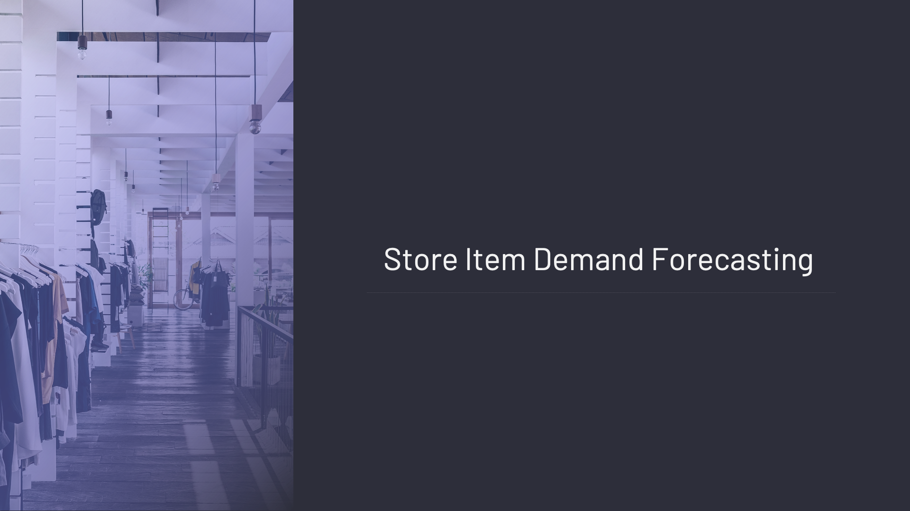

# Store-Item-Demand-Forecasting-Project

 

## Business Problem

Our business problem is to develop a demand forecasting model for store-item breakdown. Our aim is to make predictions for different products in different stores for 3 months ahead.

## Dataset Story

This data set we have is a five year data set. The data set includes 10 different stores and 50 unique product information. Kaggle Data Source: https://www.kaggle.com/c/demand-forecasting-kernels-only

## Features of Dataset

- **Total Features :** 5
- **Total Row :** 958.000
- **CSV File Size:** 17.8 MB

## Variable Descriptions

**Date:** Date of the sale data. There are no holiday effects or store closures.

**Store:** Unique Store ID 

**Item:** Unique Item ID

**Sales:** Number of items sold at a particular store on a particular date.

**ID:** Unique Sales ID
