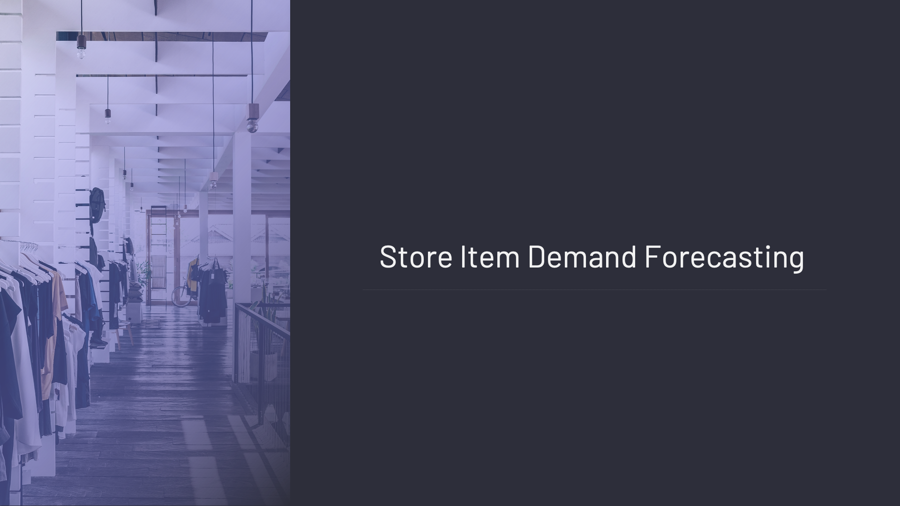

# Store-Item-Demand-Forecesting-Project

 

## Business Problem 

Our business problem is to develop a demand forecasting model for store-product segmentation. Our goal is to make forecasts for different products located in different stores for 3 months ahead.

## Dataset Story

We have a dataset that spans 5 years, consisting of information from 10 different stores and 50 different products.

## Features of Dataset

- **Total Features :** 5
- **Total Row :** 958.000
- **CSV File Size :** 43.9 MB

## Variable Descriptions

**date:** Date

**store:** Store ID

**item:** Item ID

**sales:** Sales Quantity

**ID:** Sales ID
